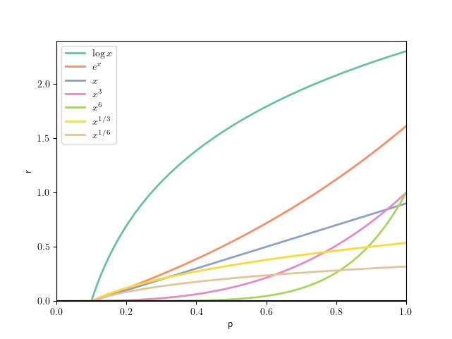

## Analysis of $g$ functions

Here we present the systematic study of the selection of $g$ functions, and show the verification of our proposed methods. In short, $g$ should be 1)  able to preserve information and 2) less sensitive to noise, which leads to the success of our proposed clipped linear form. We plot the $g$ functions as reference and further analyze from these two perspectives.

Figure A. Plot of clipped rewards with $g(p)$, $p \in [0,1]$. 

- As is analyzed in Eq. 13 and Eq. 14 (line 263, right column) in the paper, the impact of noise (variance) can be analyzed by examining the first (slop) and second derivative (curvature). Further check Analysis 1.
- On the other hand, their curvation similarity to the logarithm can also help understand the diverse performance from an information transmission perspective. Further check Analysis 2.

### Information Transmission

Figure B. Information fidelity with reward hacking experiments for $g$ functions.
 
**Analysis 1**: In reward hacking experiments, the noise is regarded as sufficiently low since the rewards are provided by an approximated oracle discriminator. The discriminator is a control variable such that g’s ability to preserve information can be reflected by its performance difference from the logarithmic function (Note that to maximize $I(y;\tau)$, $\log$ function works well where noise is not an issue, e.g. for our reward hacking experiments). 
Compared with logarithm as a baseline, linear shows comparable performance, and others show different amounts of a performance drop, among which $x^6$ shows an unacceptable information loss (#). It can also be predicted/explained by Fig. C, where $x^6$ compress a wide range of values, say [0, 0.6], to values close to zero, leading to a dramatic ignorance of information in various observations.

### Noise Impact
Figure C. The impact of noise quantified with and without reward hacking for individual $g$ function. 

**Analysis 2**: As is shown in a), $\log$ is sensitive to noise due to its high variance as we discussed in sec. 4 Reward Noise Moderation, while the linear form shows a smaller gap, being more robust to noise. Apparently, there are other $g$ functions that can be more tolerant of noise. However, their upper-performance bounds are limited by their inefficiency in information transmission (see (#) in Analysis 1 or the absolute value here), resulting in worse performance than linear form.
