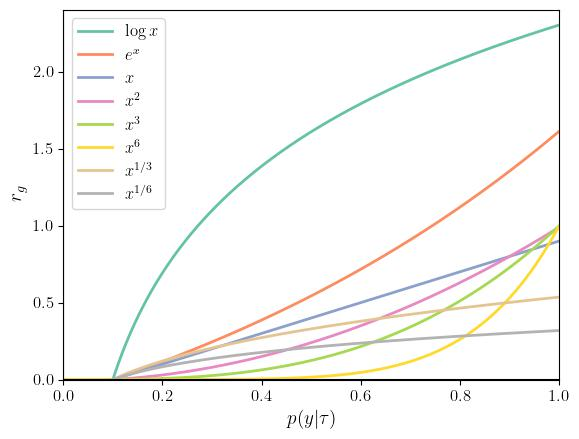
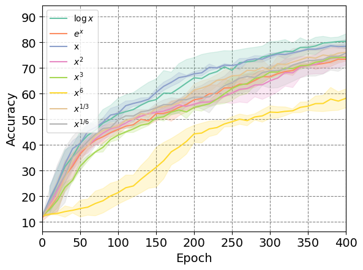
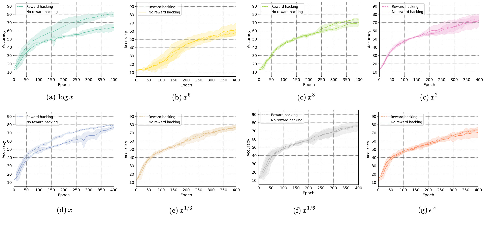

## Analysis of $g$ functions
We addtionally present a study of the selection of $g$ functions, and show the verification of our proposed methods. Besides logarithmic and linear function, extra experiments on $g(x) = x^{\alpha}$, where $\alpha = 1/6, 1/3, 3, 6$ are conducted with reward hacking (to examine its information fidelity) and without reward hacking (to examine its performance in joint learning of the policy and the discriminator). In short, $g$ should be 1)  able to preserve information and 2) less sensitive to noise, which leads to the success of our proposed clipped linear form. We plot the $g$ functions as reference and further analyze from these two perspectives.

Figure A. Plot of rewards when using different $g$ functions. The x-axis is the posterior probability $q_\phi(y|\tau) \in [0,1]$, and the y-axis is the reward value calculated according to Eq. 9 with reward clipping

- Their curvation similarity to the logarithm can help understand the diverse performance from an information transmission perspective. Please further check Analysis 1 for details.
- On the other hand, as is analyzed in Eq. 14 (line 263, right column) in the paper, the impact of noise (variance) can be analyzed by examining the first- (slope) and second-order derivative (curvature). Please further check Analysis 2.

### Information Transmission

Figure B. Information fidelity with reward hacking experiments for $g$ functions.
 
**Analysis 1**: In reward hacking experiments, the noise is regarded as sufficiently low since the rewards are provided by an approximated oracle discriminator. The discriminator is a control variable such that $g$’s ability to preserve information can be reflected by its performance difference from the logarithmic function. Note that to maximize $I(y;\tau)$, $\log$ function works well when/where reward noise is deemed low, e.g. in our reward hacking setup.
Compared with the logarithm as a baseline, the linear function shows comparable performance, and others show different amounts of a performance drop [#], among which $x^6$ shows an unacceptable information loss. It can also be predicted/explained by Fig. C, where $x^6$ compress a wide range of values, say [0, 0.5], to values close to zero, leading to a dramatic ignorance of information in various observations.

### Noise Impact

Figure C. The impact of noise quantified with and without reward hacking for individual $g$ function. 

**Analysis 2**: As is shown in a), the logarithm is sensitive to noise due to its high variance as we discussed in sec. 4 Reward Noise Moderation, while the linear form shows a smaller gap, being more robust to noise. Though there are other $g$ functions that can be more tolerant of noise, e.g. $x^6$ presents sufficiently low $\mathbb{V}(\epsilon)$ (being consistent in both theory and experimental results), their upper-performance bounds are limited by their inefficiency in information transmission (see [#] in Analysis 1 or the absolute value here), resulting in worse performance than the linear form.
